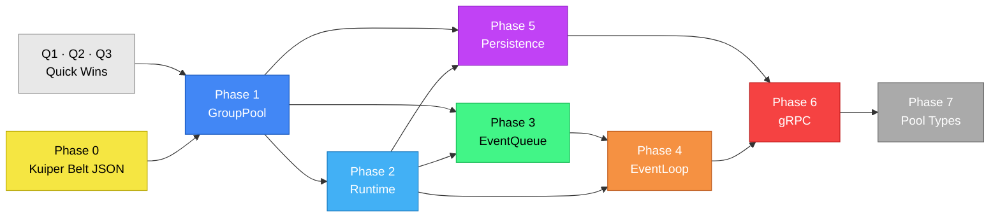

# Package: space

## Description

`space` is the real-time solar system simulation package. It is split across three sub-packages with a clean import hierarchy:

```
internal/space/engine   →  stdlib only
internal/space/ui       →  space/engine
internal/space/         →  space/engine
cmd/space-sim           →  space + space/engine + space/ui + raylib
```

The package is intentionally decoupled from Raylib — it owns no rendering code and holds no Raylib types, making it independently testable and reusable.

This package originated as a smoke test for a broader Space Sim architecture — proving out the double-buffer model, JSON-driven data loading, Keplerian orbital mechanics, and parallel physics. It has since grown into its own standalone application. See [docs/wip/smoke-test-origin.md](../../docs/wip/smoke-test-origin.md) for the original planning document.

---

## Goals

- Demonstrate a lock-free, zero-allocation double-buffer simulation loop running at 60 Hz
- Provide accurate Keplerian orbital mechanics (elliptical orbits, true anomaly, 3D inclination)
- Load all simulation content from JSON — no hardcoded planetary data
- Support dynamic, lazily-allocated asteroid belt datasets (200 → 24K objects) without pausing
- Expose clean interfaces to the render layer without exposing internal simulation concurrency
- Serve as a reference implementation for the eventual full engine architecture

---

## Package: `space/engine`

Pure simulation kernel. No SOL-specific knowledge. Imports stdlib only.

### `math.go`
3D math primitives.

- `Vector3` — Add, Sub, Scale, Dot, Cross, Normalize, Length
- `Color` — RGBA byte color

### `object.go`
Core data model for a simulated body.

- `MaterialType` — Stellar, Rocky, Gaseous, Icy, Metallic
- `ObjectCategory` — Planet, Moon, DwarfPlanet, Satellite, Star, Ring, Belt (iota-ordered; tests guard the values)
- `AsteroidDataset` — Small (0) … Huge (3) — dataset level enum
- `ObjectMetadata` — physical properties, Keplerian orbital elements, rendering hints (importance, material, color)
- `AnimationState` — per-frame mutable state: position, velocity, mean/true anomaly, orbit center
- `Object` — immutable metadata + mutable animation state + visibility/dataset flags

### `feature.go`
JSON schema types for procedural belt/ring features.

- `FeatureConfig` — top-level feature descriptor (type, name, distribution, orbital mechanics, procedural settings, object types)
- `FeatureDistribution` — inner/outer radius, thickness, classical belt range/probability
- `FeatureProcedural` — color palette, variation, seed
- `FeatureObjSpec` — per-object-type count/importance/size arrays indexed by dataset level
- `FeatureOrbitalMechanics` — Kepler flag, eccentricity/inclination ranges, distance-to-AU ratio

### `state.go`
Scene container and double-buffer synchronization.

- `SimulationState` — full scene: object slice + map, simulation time, `SecondsPerSecond`, dataset tracking, belt configs
- `DoubleBuffer` — lock-free front/back pointer swap; `SwapInPlace()` zero-alloc optimization; `Clone()` for full deep copy
- `DisableInPlaceSwap()` / `EnableInPlaceSwap()` — safety guards during dynamic object allocation
- `LockFrontWrite()` / `UnlockFrontWrite()` — exclusive write access to the front buffer (used when both buffers must be mutated in sync)

### `pool.go`
Reusable object pool for clone-mode front-buffer swaps.

- `ObjectPool` — sync.Pool-backed pool of `*Object`
- `Borrow()` / `Return()` — acquire/release pooled objects used during clone-based swaps
- `PoolStats` — borrow, return, and allocation counters for pool activity
- **Status**: active for clone-mode swapping when in-place swap is disabled

### `constants.go`
All rendering, camera, and spatial constants.

- Camera: `CameraFOV`, `CameraNearPlane`, `CameraFarPlane`, `CameraTrackDistMin/Max`
- LOD: `PointThreshold*`, `PointSize*`, `LOD*`
- Spatial: `SpatialGridCellSize`, `SpatialGridMaxObjectsPerCell`
- Frustum: `FrustumMargin*`

### `physics.go`
Simulation goroutine and orbital mechanics solver.

- `Simulation` — owns the `DoubleBuffer`, tick rate (`hz`), speed controls, dataset change channel
- `NewSimulation(state, hz, applyDatasetFn)` — wires state into double buffer, enables in-place swap
- `Start(ctx)` — 60 Hz goroutine loop; applies `sim.speed` throttle, drains dataset change channel, calls `update()`
- `update(dt)` — scales `dt` by `SecondsPerSecond`, updates time, dispatches parallel parent/child physics passes, swaps buffers
- `updateObject()` — Kepler's equation → eccentric anomaly → true anomaly → 3D position via orbital rotation matrix
- `solveKeplersEquation()` — Newton-Raphson solver for `M = E - e·sin(E)`
- `calculateTrueAnomaly()` — converts eccentric anomaly to true anomaly
- `rotateOrbit()` — applies argument of periapsis (ω), inclination (i), longitude of ascending node (Ω) rotations

---

## Package: `space/ui`

Generic UI and camera state. Imports `space/engine` only. No Raylib types.

### `camera.go`
Camera state machine and movement logic.

- `CameraState` — position, forward vector, yaw/pitch angles, mode, tracking target index, jump interpolation state
- `CameraMode` — `Free`, `Jumping`, `Tracking`
- `StartTracking()` / `StartTrackingEquatorial()` — lock camera to orbit around a specific object
- `UpdateTracking()` — recomputes camera position each frame relative to tracked object's current position
- `StartJumpTo()` / `UpdateJump()` — smooth lerp-based jump animation to a target position
- `AdjustTrackAngles()` — mouse-driven orbit angle adjustment while tracking
- `CalculateAutoZoomDistance()` — compute view distance to fit an object at a given screen percentage

### `input.go`
UI selection and performance option state.

- `InputState` — selection mode, selected index, filter text, scroll offset, current selection mode (Jump/Track/Performance)
- `PerformanceOptions` — toggles for frustum culling, spatial partitioning, LOD, point rendering, in-place swap
- `SelectionMode` — None, Jump, Track, TrackEquatorial, Performance
- `StartSelection()` / `CancelSelection()` / `ConfirmSelection()` — selection lifecycle
- `SelectNext()` / `SelectPrevious()` / `CycleCategory()` / `CycleCategoryBack()` — list navigation

---

## Package: `space`

SOL-specific application layer. Imports `space/engine`. No Raylib types.

### `simulation.go`
Thin SOL wrapper around `engine.Simulation`.

- `Simulation` — embeds `*engine.Simulation`
- `NewSimulation(hz, configPath)` — loads system from JSON, constructs `applyFn` closure (two-phase `dbPtr` init to avoid circular dependency), calls `engine.NewSimulation`
- `applyBeltConfig(state, config, dataset, rng)` — translates `*engine.FeatureConfig` into `BeltConfig` and calls `CreateBelt`; used for dataset-swap allocation in both buffers
- `GetAsteroidCount(dataset)` / `GetDatasetName(dataset)` — public dataset metadata helpers
- `asteroidCount()` / `datasetName()` — private switch-table helpers; single source of truth for dataset sizes and display names

### `config.go`
JSON schema structs for the solar system file format.

- `SystemConfig` — top-level; `Bodies []BodyConfig`, `Features []engine.FeatureConfig`, scale factor, state overrides
- `BodyConfig`, `OrbitConfig`, `PhysicalConfig`, `RenderingConfig`, `LODLevel`, `AtmosphereConfig` — body descriptor hierarchy
- `StateConfig` — default simulation state overrides from JSON
- `TemplateLibrary` — named templates for stars, planets, moons, asteroids; `Features map[string]engine.FeatureConfig`

### `loader.go`
JSON-to-simulation-state pipeline.

- `LoadSystemFromFile()` — entry point; parses system JSON, applies scale factor, initializes state
- `LoadTemplateLibrary()` — loads body templates from a file or directory of JSON files
- `createBodyFromConfig()` — merges template + override, computes orbital period in seconds, constructs `engine.Object`
- `applyOverrides()` — deep merge of template and instance config
- `createFeatureFromConfig()` — dispatches `asteroid_belt` / `kuiper_belt` to `createBeltFromConfig()`, rings to `createRingSystemFromConfig()`
- `createBeltFromConfig()` — translates `engine.FeatureConfig` into `BeltConfig`, calls `CreateBelt` at the initial dataset level
- `createRingSystemFromConfig()` — validates feature config, resolves the parent object, and creates runtime ring objects from `ring_system` features

### `objects.go`
Constructor functions for core celestial body types.

- `NewSun()`, `NewPlanet()`, `NewMoon()`, `NewDwarfPlanet()`, `NewSatellite()` — typed constructors returning `*engine.Object`
- `NewAsteroid()` — minimal asteroid with category and dataset flags
- `PlanetColors` — predefined color palette for planets

### `belts.go`
Procedural generation of large-scale debris populations.

- `BeltConfig` — all belt geometry parameters: inner/outer radius, thickness, eccentricity/inclination ranges, classical belt zone, color palette, object type map
- `BeltObjectTypeConfig` — per-type count, size range, and importance within a belt
- `CreateBelt(state, config, dataset, rng)` — unified belt generator; populates `SimulationState` with `engine.Object` entries; used by both `loader.go` (initial load) and `simulation.go` (dataset swap)
- `clampUint8()` — color arithmetic helper

---

## Known Gaps

| Gap | Location | Notes |
|-----|----------|-------|
| Kuiper Belt dataset switching parity | `simulation.go` | ✅ Resolved: dataset allocation/visibility path now applies to both `asteroid_belt` and `kuiper_belt` features via shared belt config translation |
| Help screen layout hardcoded | `cmd/space-sim/main.go` | `TODO(tech-debt-8)`: magic number offsets in `drawHelpScreen()` |

---

## System Architecture

```mermaid
graph TD
    subgraph Client["Client Layer"]
        REPL["REPL / SDK"]
        Raylib["Raylib Renderer\ncmd/space-sim"]
    end

    subgraph Transport["Transport Layer (Phase 6)"]
        gRPC["gRPC Server\npkg/transport/grpc"]
    end

    subgraph Server["Server Layer"]
        EL["Event Loop\ninternal/server/eventloop\nPhase 4"]
        WP["Worker Pool\nwork-stealing, NumCPU\nPhase 4"]
        EQ["Event Queue Manager\ninternal/server/eventqueue\nPer-GUID FIFO · Phase 3"]
        RT["Runtime Environment\ninternal/server/runtime\nObjectState · GroupState · Phase 2"]
        GP["GroupPool\ninternal/server/pool/group\nDefinitions · DAG · Locks · Phase 1"]
    end

    subgraph Persistence["Persistence Layer (Phase 5)"]
        DEF["Definitions\nJSON"]
        SNAP["Snapshots\nProtobuf"]
        ELOG["Event Log\nAppend-only"]
    end

    subgraph SmokeEng["space/engine"]
        PHYS["physics.go\nSimulation loop · Kepler"]
        STATE["state.go\nDoubleBuffer · SimulationState"]
        ENGOBJ["object.go · math.go\nObject · Vector3 · AsteroidDataset"]
        FEAT["feature.go\nFeatureConfig"]
        POOL["pool.go\nObjectPool for clone-mode swaps"]
        CONST["constants.go\nLOD · Frustum · Camera"]
    end

    subgraph SmokeUI["space/ui"]
        CAM["camera.go\nCameraState · CameraMode"]
        INPUT["input.go\nInputState · PerformanceOptions"]
    end

    subgraph SmokeApp["space"]
        SIM["simulation.go\nNewSimulation · applyBeltConfig"]
        LOAD["loader.go\nsolar_system.json pipeline"]
        BELTS["belts.go\nBeltConfig · CreateBelt"]
        OBJS["objects.go\nNewSun · NewPlanet · …"]
        CFG["config.go\nSystemConfig · TemplateLibrary"]
    end

    Raylib -->|"reads front buffer"| STATE
    Raylib -->|"camera / input"| CAM
    Raylib -->|"selection state"| INPUT

    SIM -->|"engine.NewSimulation"| PHYS
    SIM -->|"applyBeltConfig → CreateBelt"| BELTS
    LOAD -->|"populates"| STATE
    LOAD -->|"createBeltFromConfig → CreateBelt"| BELTS
    BELTS -->|"AddObject"| STATE
    OBJS -->|"engine.Object"| ENGOBJ
    CFG -->|"FeatureConfig"| FEAT

    REPL -->|"RPC commands"| gRPC
    gRPC -->|"Enqueue(event)"| EQ
    gRPC -->|"Query state"| RT
    EL -->|"drain queues"| EQ
    EL -->|"dispatch tasks"| WP
    EL -->|"commit frame"| RT
    EQ --> GP
    RT --> GP
    WP --> RT
    GP -->|"save/load"| DEF
    RT -->|"snapshot"| SNAP
    EQ -->|"append"| ELOG

    classDef phase0 fill:#f5e642,stroke:#b8a800,color:#000
    classDef phase1 fill:#4287f5,stroke:#1a5abf,color:#fff
    classDef phase2 fill:#42b0f5,stroke:#1a7abf,color:#fff
    classDef phase3 fill:#42f587,stroke:#1abf5a,color:#000
    classDef phase4 fill:#f59142,stroke:#bf5a1a,color:#fff
    classDef phase5 fill:#c142f5,stroke:#8a1abf,color:#fff
    classDef phase6 fill:#f54242,stroke:#bf1a1a,color:#fff
    classDef eng    fill:#1e1e2e,stroke:#7f7fbf,color:#cdd6f4
    classDef ui     fill:#1e2e1e,stroke:#7fbf7f,color:#cdd6f4
    classDef app    fill:#2e1e1e,stroke:#bf7f7f,color:#cdd6f4

    class GP phase1
    class RT phase2
    class EQ phase3
    class EL,WP phase4
    class DEF,SNAP,ELOG phase5
    class gRPC phase6
    class PHYS,STATE,ENGOBJ,FEAT,POOL,CONST eng
    class CAM,INPUT ui
    class SIM,LOAD,BELTS,OBJS,CFG app
```



## Implementation Dependency Order


